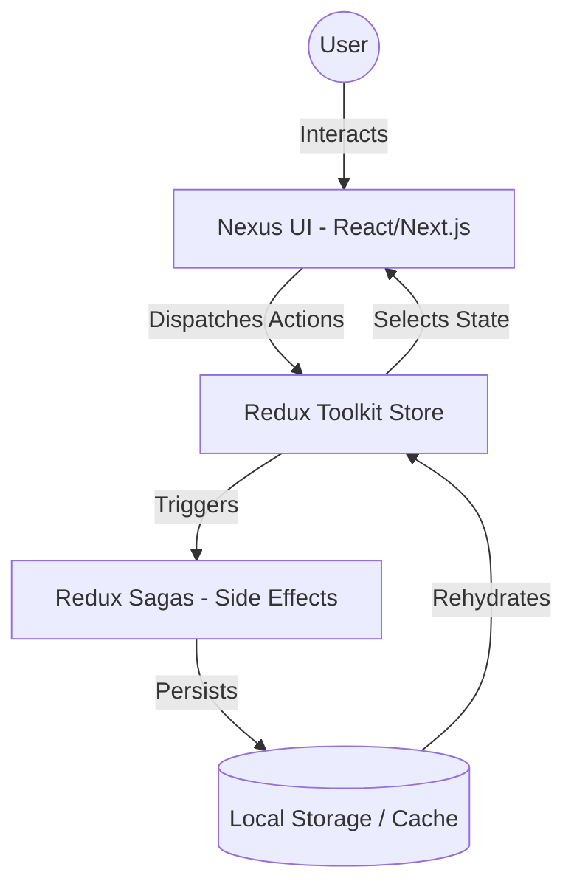

# 📝 Nexus Notes - Professional Productivity Platform

Nexus Notes is a high-performance, enterprise-grade note-taking application built with **Next.js 15**, **Tailwind CSS 4**, and **Redux Saga**. It evolves the traditional "note app" into a professional productivity platform using a 3-pane architecture designed for focused deep work and seamless information management.

---

## 🚀 Purpose & Vision

In an era of information overload, Nexus Notes provides a "clean slate" for professionals. It is built to minimize cognitive friction during data entry while providing robust, high-speed retrieval mechanisms. 

### Why Nexus Notes?
- **Speed**: Built on Next.js 15 with Turbopack for near-instant interaction.
- **Organization**: Move beyond simple lists with nested folders, pinning, and multi-tagging.
- **Reliability**: Offline-first mindset with local storage persistence and background synchronization.
- **Aesthetics**: A premium "Nexus" design system that feels high-end and distraction-free.

---

## 🏗️ System Architecture

Nexus Notes uses a modern, decoupled architecture to separate concerns between UI, State Management, and Side Effects.



### Major Modules
- **Next.js App Router**: Handles the layout, routing, and server/client component balancing.
- **Redux Toolkit**: Manages global state for notes, active selection, and search queries.
- **Redux Saga**: Handles the asynchronous "heavy lifting"—autosaving, data validation, and complex state transitions.
- **TipTap Engine**: A headless editor framework that provides the robust rich-text foundation.

---

## 🧩 Internal Structure & Component Map

### 📁 Directory Layout
```text
src/
├── app/
│   ├── globals.css      # Tailwind 4 configuration & custom theme
│   ├── layout.tsx       # Root layout with font/provider injection
│   └── page.tsx         # Main Dashboard assembly
├── components/
│   ├── Sidebar.tsx      # Navigation & Profile management
│   ├── NoteEditor.tsx   # Primary workspace & Metadata panel
│   ├── RichTextEditor.tsx # TipTap implementation & Toolbar
│   ├── CommandPalette.tsx # Fuzzy search & Global actions (⌘K)
│   └── TagInput.tsx     # Specialized UI for metadata management
├── lib/
│   ├── store.ts         # Redux store configuration
│   ├── notesSlice.ts    # Note logic (CRUD, Pining, Tags)
│   └── sagas.ts         # Persistence & Side-effect logic
└── types/
    └── index.ts         # Shared TypeScript interfaces
```

### Component Connectivity
1. **Sidebar ↔ NoteEditor**: Clicking a note in the Sidebar updates the `activeNoteId` in Redux, which causes the `NoteEditor` to re-render with the new content.
2. **NoteEditor ↔ RichTextEditor**: The `NoteEditor` passes content and a debounced change handler to the TipTap instance.
3. **Command Palette ↔ All**: The Palette provides a global portal to navigate between notes or trigger app-wide commands (like creating a new note).

---

## 🔄 Workflow & Data Flow

Understanding the **"Nexus Save Loop"**:

1. **The Trigger**: The user types a single character in the `RichTextEditor`.
2. **Local State**: The editor updates its local React state for zero-latency feedback.
3. **Debounce**: A 500ms timer starts. If the user types again, the timer resets.
4. **The Update**: Once the timer elapses, an `updateNote` action is dispatched to the Redux store.
5. **The Side Effect**: Redux Saga detects the change and triggers a `saveNoteRequest`.
6. **Persistence**: The Saga handles the asynchronous task of saving the note to `localStorage`.
7. **Sync**: The Sidebar and all other components observing the `notes` state are updated via Redux selectors.

---

## 🛠️ Technology Stack

| Category | Technology |
| :--- | :--- |
| **Core** | Next.js 15, React 19, TypeScript |
| **Styling** | Tailwind CSS 4, Framer Motion, Lucide Icons |
| **State** | Redux Toolkit, Redux Saga |
| **Editor** | TipTap (ProseMirror based) |
| **Search** | Fuse.js (Fuzzy Matching) |

---

## 📦 Installation & Setup

Nexus Notes is designed to be beginner-friendly. Follow these steps to get started:

### 1. Clone the Repository
```bash
git clone https://github.com/santanu949/Interactive-Note-App-using-Next.js.git
cd Interactive-Note-App-using-Next.js
```

### 2. Install Dependencies
```bash
npm install
```

### 3. Start the Platform
```bash
npm run dev
```
The application will start on **[http://localhost:3000](http://localhost:3000)**.

### 4. Build for Production
To create an optimized production bundle:
```bash
npm run build
npm start
```

---

## 👨‍💻 Author
**Santanu Samanta**
- [GitHub](https://github.com/santanu949)
- [LinkedIn](http://linkedin.com/in/santanusamanta4187)

---

## 📝 License
This project is licensed under the MIT License - see the LICENSE file for details.

---

*Architected and documented by Antigravity.*
