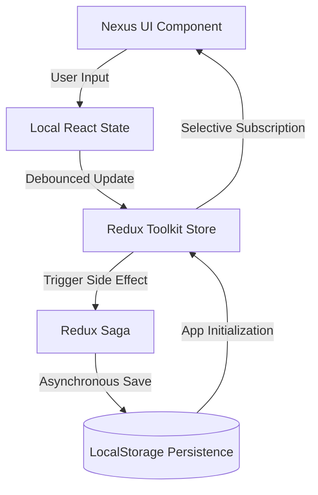

# 📝  Productivity Platform


Nexus Notes is a high-density, enterprise-grade note-taking platform designed for professional deep work. It leverages the latest **Next.js 15** architecture and **Tailwind CSS 4** engine to provide a seamless, high-performance workspace for managing complex documentation, thoughts, and tasks.

---

## 🌟 Overview

### The Problem
Traditional note-taking apps often suffer from either over-simplicity (lacking organizational depth) or over-complexity (creating cognitive friction during the capturing process). Professionals need a tool that can keep up with the speed of thought while automatically handling the structured organization required for long-term knowledge management.

### The Solution
Nexus Notes solves this by implementing a **3-Pane Studio Layout** that separates navigation, content creation, and metadata management. By combining a "Capture First" philosophy with background persistence and intelligent organization, it ensures that your focus remains on the content, not the tool.

---

## 🚀 Key Features

### 🖋️ Software & Editor Capabilities
- **Hybrid Markdown/WYSIWYG Editor**: Real-time rich text editing powered by TipTap with support for task lists, code blocks, and blockquotes.
- **Nexus Command (⌘K)**: A global command palette for instant navigation and action execution.
- **Intelligent Organization**: Nested folder hierarchies, pinning for high-priority notes, and a multi-tagging system.
- **Fuzzy Search Engine**: High-speed, full-text search across titles and content using Fuse.js.

### ⚙️ System Features
- **Real-time Persistence**: Debounced autosave mechanism that ensures zero data loss via Redux Saga and LocalStorage.
- **Focus Mode Architecture**: Responsive design that adapts from a high-density dashboard to a distraction-free mobile workspace.
- **Metadata Analytics**: Automatic tracking of creation dates, modification times, and content statistics (word/character counts).

---

## 🏗️ System Architecture

Nexus Notes is built on a **Decoupled Reactive Model**. The UI reacts to state changes, while heavy logic (like persistence) is handled in background threads.



---

## 🛠️ Tech Stack

### Frontend Layer
- **Next.js 15**: App Router architecture with Turbopack for lightning-fast development.
- **React 19**: Utilizing the latest concurrent rendering features.
- **Framer Motion**: Smooth micro-animations and layout transitions.

### Styling & Design
- **Tailwind CSS 4**: Modern CSS engine with container queries and improved design tokens.
- **Lucide React**: High-consistency icon system for clear visual communication.
- **Inter Font**: Optimized for screen readability.

### State & Persistence
- **Redux Toolkit**: Centralized state management for notes and UI state.
- **Redux Saga**: Handling complex side effects and persistent synchronization.
- **Fuse.js**: Client-side fuzzy searching logic.

---

## 📦 Setup & Installation

Follow these steps to deploy Nexus Notes to your local environment:

### 1. Environment Preparation
Ensure you have **Node.js (v18.0.0 or later)** and **npm** installed.

### 2. Repository Cloning
```bash
git clone https://github.com/santanu949/Interactive-Note-App-using-Next.js.git
cd Interactive-Note-App-using-Next.js
```

### 3. Dependency Installation
```bash
npm install
```

### 4. Running the Project
```bash
npm run dev
```
Open **[http://localhost:3000](http://localhost:3000)** in your browser.

---

## 📖 Usage Guide

1. **Quick Capture**: Use the **"New Note"** button in the sidebar or hit `⌘K` and type "New" to instantly start a workspace.
2. **Rich Editing**: Use the floating toolbar to format text, add task lists, or insert code blocks.
3. **Organization**: Drag tags from the Properties panel or click the **Pin** icon to keep critical notes at the top.
4. **Global Search**: Hit `⌘K` from anywhere in the app to search through all your knowledge.
5. **Autosave**: Just stop typing. The app handles the rest, persisting your work every 500ms of inactivity.

---

## 📂 Project Structure

```text
src/
├── app/               # Application shell, layout, and theme tokens
├── components/        # Isolated UI components (Sidebar, Editor, Palette)
├── lib/               # Business logic, state slices, and sagas
├── types/             # Domain-specific TypeScript definitions
└── utils/             # Shared utility functions and constants
```

---

## 📈 Current Status

- **Phase 1: Content Foundation** — ✅ COMPLETED
- **Phase 2: Advanced Organization** — ✅ COMPLETED
- **Phase 3: Collaboration Features** — 🏗️ IN PROGRESS (Authentication & Sync)
- **Phase 4: AI Intelligence** — 📝 PLANNED (Auto-summarization & Tagging)

---

## 👨‍💻 Ownership & Contributors

**Santanu Samanta**
- [GitHub](https://github.com/santanu949)
- [LinkedIn](http://linkedin.com/in/santanusamanta4187)

---

